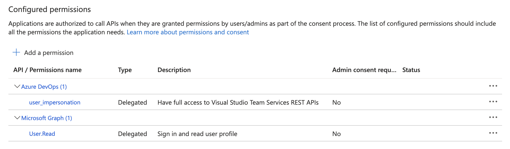

# Azure Active Directory PowerShell Client

Demonstrates the use of AAD sign in from PowerShell script, leveraging [device authorization grant flow](https://learn.microsoft.com/azure/active-directory/develop/v2-oauth2-device-code). See [Headless samples](https://learn.microsoft.com/azure/active-directory/develop/sample-v2-code#headless) for C#, Java, Python flavors.

## Setup
This repo contains Terraform templates to create the AAD application needed to perform authentication, and PowerShell scripts to handle the authentication itself.

### Create AAD application with Terraform
Specific [settings](terraform/modules/application/main.tf) that make device code flow work are:

```hcl
  fallback_public_client_enabled = true 
  sign_in_audience             = "AzureADMyOrg"
  required_resource_access {
    # App id of the resource you want to access once logged in
    # e.g. 2ff814a6-3304-4ab8-85cb-cd0e6f879c1d for DataBricks
    resource_app_id            = var.resource_app_id
    resource_access {
      # e.g. 739272be-e143-11e8-9f32-f2801f1b9fd1 for user_impersonation
      id                       = var.resource_access_id
      type                     = "Scope"
    }
  }
  required_resource_access {
    resource_app_id            = "00000003-0000-0000-c000-000000000000" # Microsoft Graph
    resource_access {
      id                       = "e1fe6dd8-ba31-4d61-89e7-88639da4683d" # User.Read
      type                     = "Scope"
    }
  }
```
Which will show up in the portal as:
<p align="center">

</p>   
And:
<p align="center">

</p>   
Steps:  

- Set the `tenant_id` Terraform variable or `ARM_TENANT_ID` environment variable to a tenant you have [permission to consent applications](consent.md) in
- Set the `resource_application_name` Terraform variable to a well known application you want to sign in to, see [`application_published_app_ids`](https://registry.terraform.io/providers/hashicorp/azuread/latest/docs/data-sources/application_published_app_ids) data source. You can also uncomment the `microsoft_applications` output to list well known application names.
- Initialize workspace with `terraform init`
- Provision resources with `terraform apply` or running [`deploy.ps1`](scripts/deploy.ps1)

### Login with PowerShell
Once the AAD application is provisioned, run [`login.ps1`](scripts/login.ps1) to get an AAD token for the resource configured. This script will propagate the appId of the AAD application created.

### End-to-end demo
You can run AAD application provisioning and login using a single script: [`demo.ps1`](scripts/demo.ps1). If you provision the AAD application and then immediately try to log in, you may enter a race condition where the application is not available yet.