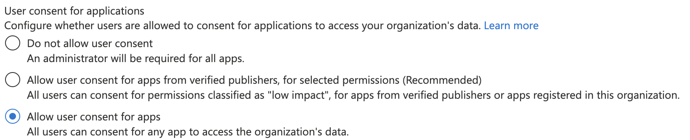
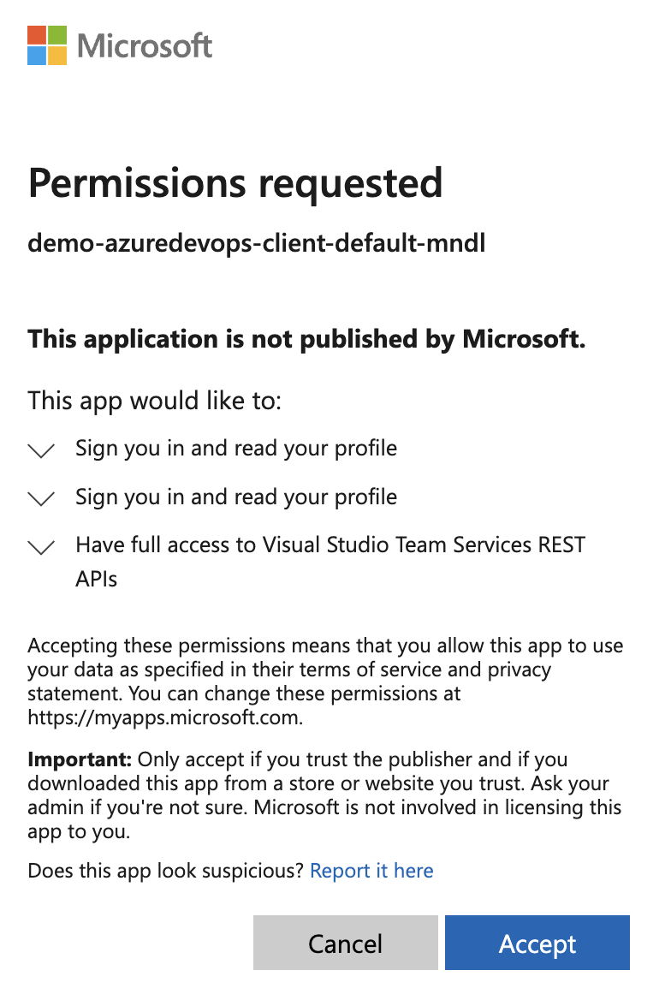
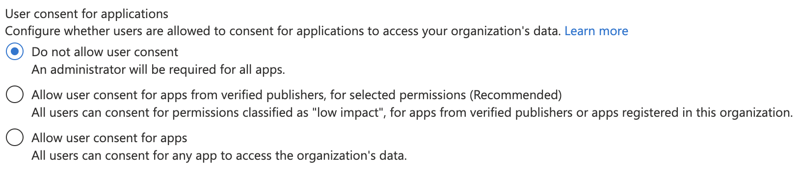
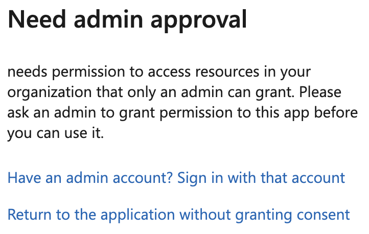
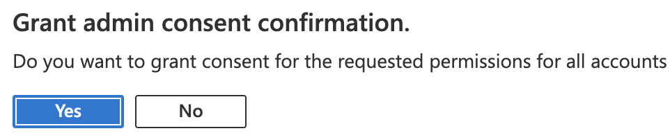
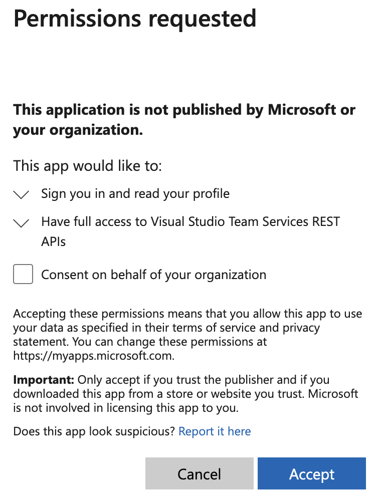

# Consent
You may not have [permission to consent applications](https://learn.microsoft.com/azure/active-directory/manage-apps/configure-user-consent?pivots=portal) in a given AAD tenant.

## Provide consent as a user
If a tenant allows user consent:

   
Users can consent themselves:

   

## Admin consent required
If a tenant requires admin consent:

   
Users can't access the application:

   
Until an admin has provided consent from the portal:

   
Or when logging into the application:

   
